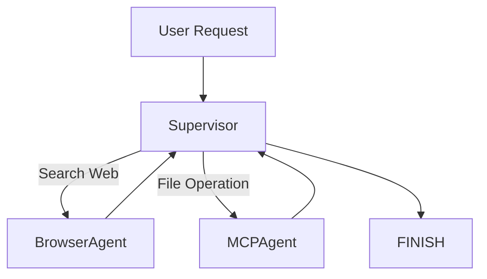

# Multi-Agent Autonomous Work System

<div align="center">

# 🤖 Multi-Agent Autonomous Work System

### A LangGraph-based Autonomous Multi-Agent Workflow System

[]()
[]()
[]()
[]()
[]()
[]()

A task-oriented autonomous agent system built with LangGraph, integrating browser automation, model routing, MCP tools, and extensible workflow orchestration.

</div>

---

# 📖 Overview

Traditional chatbots can answer questions.

This project aims to execute tasks.

The system uses a Supervisor-Agent architecture built on LangGraph to dynamically determine which agent should act next based on the user's goal.

It combines:

* DeepSeek for reasoning
* Browser-Use for browser automation
* MCP for local tool access
* One-API for model routing
* LangGraph for workflow orchestration

The result is an extensible autonomous workflow framework capable of searching information, operating files, calling tools, and executing multi-step tasks.

---

# ✨ Features

## 🧠 Intelligent Task Routing

A Supervisor node analyzes the user's intent and decides:

* Which agent should execute next
* What instruction should be passed
* Whether the task is finished

---

## 🌐 Browser Automation

Powered by Browser-Use.

Capabilities:

* Search information online
* Visit websites
* Extract key content
* Summarize findings

Automatic fallback is implemented when browser automation fails.

---

## 📁 MCP Tool Integration

Connects local tools through Model Context Protocol (MCP).

Current capabilities:

* File creation
* File writing
* Workspace management

Future MCP extensions:

* Database access
* Local application control
* External APIs
* Code execution

---

## 🔄 Autonomous Workflow Loop

The system continuously evaluates task progress.

```text
User Request
      ↓
 Supervisor
      ↓
Agent Execution
      ↓
Result Feedback
      ↓
 Supervisor
      ↓
Task Finished
```

This enables multi-step task execution rather than single-turn responses.

---

# 🏗 Architecture



---

# ⚙ Workflow Design

## Supervisor

Responsibilities:

* Analyze user intent
* Generate execution instructions
* Select appropriate agent
* Determine task completion

Example output:

```json
{
  "next": "BrowserAgent",
  "instruction": "Search latest DeepSeek developments"
}
```

---

## BrowserAgent

Responsibilities:

* Browser automation
* Search execution
* Information extraction
* Result summarization

Primary path:

```text
Browser-Use
```

Fallback path:

```text
Direct HTTP Retrieval
```

This ensures robustness when browser automation encounters unexpected page structures.

---

## MCPAgent

Responsibilities:

* File operations
* Tool invocation
* Workspace management

Current implementation:

```text
Create Report
Write File
Manage Workspace
```

---

# 🧰 Technology Stack

| Component                | Technology  |
| ------------------------ | ----------- |
| Workflow Engine          | LangGraph   |
| LLM Framework            | LangChain   |
| Language Model           | DeepSeek    |
| Model Gateway            | One-API     |
| Browser Agent            | Browser-Use |
| Tool Protocol            | MCP         |
| Runtime                  | Python      |
| OS                       | Windows     |
| Memory (Planned)         | ChromaDB    |
| Code Execution (Planned) | MCP Tools   |

---

# 📂 Project Structure

```text
.
├── main.py
├── .env
├── API.txt
├── one-api.exe
├── one-api.db
├── start.ps1
├── test_mcp.py
│
├── workspace/
│   └── Generated Reports
│
├── logs/
│   └── Runtime Logs
│
├── Python/
│   └── Dependencies
│
└── venv/
```

---

# 🚀 Installation

## 1. Clone Repository

```bash
git clone https://github.com/YOUR_USERNAME/YOUR_REPOSITORY.git

cd YOUR_REPOSITORY
```

---

## 2. Create Virtual Environment

```bash
python -m venv venv
```

Windows:

```bash
venv\Scripts\activate
```

Linux / Mac:

```bash
source venv/bin/activate
```

---

## 3. Install Dependencies

```bash
pip install -r requirements.txt
```

---

## 4. Install Node.js

Verify:

```bash
node -v

npx -v
```

MCP filesystem server depends on Node.js.

---

# 🔧 Configuration

Create a `.env` file:

```env
ONE_API_BASE=https://your-one-api-url/v1

ONE_API_KEY=your-api-key

CLAUDE_MODEL=deepseek-chat

WORKSPACE_DIR=D:\MultiAgentSystem\workspace
```

---

## Environment Variables

| Variable      | Description               |
| ------------- | ------------------------- |
| ONE_API_BASE  | One-API Endpoint          |
| ONE_API_KEY   | One-API Key               |
| CLAUDE_MODEL  | Model Name                |
| WORKSPACE_DIR | Local Workspace Directory |

---

# ▶ Usage

Run:

```bash
python main.py
```

Example:

```text
Search the latest DeepSeek developments and generate a report.
```

or

```text
Search recent AI industry news and save findings.
```

Exit:

```text
exit
```

or

```text
quit
```

---

# 📸 Example Output

```text
>>> Search latest DeepSeek developments

[BrowserAgent]
DeepSeek released ...

[Supervisor]
Task completed.

[MCPAgent]
report.txt updated successfully.
```

---

# 🔒 Reliability Design

## Browser Fallback

If Browser-Use fails:

```text
Browser Agent
      ↓
Exception
      ↓
HTTP Fallback
      ↓
Search Result
```

The workflow continues instead of terminating.

---

## Windows Compatibility

Special handling:

* WindowsProactorEventLoopPolicy
* Chrome process cleanup
* MCP subprocess management

---

# 🛣 Roadmap

## Near Term

* [ ] ChromaDB Persistent Memory
* [ ] Local Code Execution
* [ ] Multi-Agent Collaboration
* [ ] Better Planning Logic
* [ ] Tool Selection Optimization

## Mid Term

* [ ] Web Dashboard
* [ ] Agent Monitoring
* [ ] Task Visualization
* [ ] Long-Term Memory

## Long Term

* [ ] Distributed Agent Cluster
* [ ] Autonomous Research Mode
* [ ] Self-Reflection Loop
* [ ] Autonomous Project Execution

---

# 🤝 Contributing

Contributions are welcome.

Feel free to:

* Open Issues
* Submit Pull Requests
* Suggest Improvements

---

# ⚠ Disclaimer

This project is intended for learning, experimentation, and workflow automation research.

Users are responsible for complying with applicable laws, regulations, and website terms of service when using browser automation and tool integrations.

---

# 🙏 Acknowledgements

* LangGraph
* LangChain
* DeepSeek
* Browser-Use
* Model Context Protocol (MCP)
* One-API

---

# 📜 License

MIT License

Feel free to use, modify, and distribute.

---

<div align="center">

Made with ❤️ by Roy White

</div>
